# OAuth 2.0 Grant Type 개요

## 권한 부여 유형

- 클라이언트가 사용자를 대신해서 사용자의 승인하에 인가서버로부터 권한을 부여받는 것을 의미.
- OAuth 2.0 매커니즘은 아래와 같은 권한 부여 유형들을 지원하고 있으며 일부는 Deprecated 되었다.
  1. Authorization Code Grant Type
     - 권한 코드 부여 타입, 서버 사이드 애플리케이션, 보안에 가장 안전한 유형
     - 지금까지 실습한 과정이 이것인데, code를 먼저 받고 그 code를 이용해서 access Token을 얻는 방식
     - `response_type : code`
  2. Implicit Grant Type(2.1에서는 Deprecated)
     - 암시적 부여 타입, **공개 클라이언트** 어플리케이션(SPA 기반 자바스크립트 앱, 모바일 앱), **보안에 취약**
     - 이 타입을 통해서 인가 서버로 부터 access Token을 발급 받는데, 브라우저에 노출이 된다.
     - `response_type : token`
  3. Resource Owner Password Credentials Grant Type(Deprecated)
     - 리소스 사용자 비밀번호 자격증명 부여 타입, 서버 어플리케이션, **보안에 취약**
     - 사용자의 id, pw로 검증
  4. Client Credentials Grant Type
     - 클라이언트 자격 증명 권한 부여 타입, UI or 화면이 없는 서버 어플리케이션
     - client Id, client secret만 있으면 토큰 발급됨, 따라서 사용자가 client임 ( 사용자가 없음 )
     - 데몬이나 서버 to 서버에서 사용 될 수 있음
  5. Refresh Token Grant Type
     - 새로고침 토큰 부여 타입, Authorization Code, Resource Owner Password Type 에서 지원
  6. PKCE-enhanced Authorization Code Grant Type ( proof key code exchange )
     - PKCE 권한 코드 부여 타입, 서버 사이드 어플리케이션, 공개 클라이언트 어플리케이션
     - 1번타입에서 좀 더 강화된 버전

### 권한 부여 흐름 선택 기준

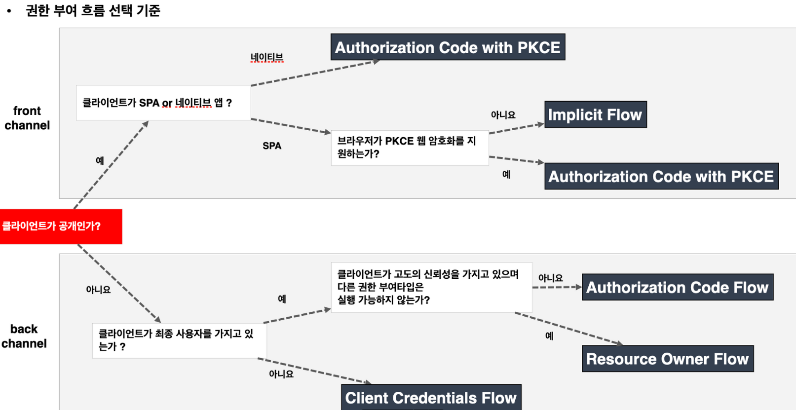

- `front channel`에는 PKCE가 붙어있다 ( 보안에 취약하기 때문 )

### 매개 변수 용어

1. client_id
   - 인가서버에 등록된 클라이언트에 대해 생성된 고유 키
2. client_secret
   - 인가서버에 등록된 특정 클라이언트의 client_id에 대해 생성된 비밀 값
3. reponse_type
   - 애플리케이션이 권한 부여 코드 흐름을 시작하고 있음을 인증 서버에 알려준다.
   - `code, token, id_token` 이 있으며 `token, id_token`은 **implicit 권한부여유형**에서 지원해야 한다.
   - 서버가 쿼리 문자열에 인증코드(code), 토큰(token, id_token)등을 반환
4. grant_type
   - 권한 부여 타입 지정 - authorization_code, password, client_credentials, refresh_token
5. redirect_uri
   - 사용자가 응용 프로그램을 성공적으로 승인하면 권한 부여 서버가 사용자를 다시 응용 프로그램으로 리다이렉트 한다.
   - redirect_uri 가 초기 권한 부여 요청에 포함된 경우 서비스는 토큰 요청에서도 이를 요구해야 한다.
   - 토큰 요청의 redirect_uri 는 인증 코드를 생성할 때 사용된 redirect_uri와 정확히 일치해야한다. 그렇지 않으면 서비스는 요청을 거부해야 한다. ( **만약 client id와 pw가 공격자에 의해 탈취당해도 redirect uri가 애초에 내가 입력한 uri이므로 인가서버가 한번더 체크 가능함** )
6. scope
   - 어플리케이션이 사용자 데이터에 접근하는 것을 제한하기 위해 사용된다 ( email, profile, read, write)
   - 사용자에 의해 특정 스코프로 제한된 권한 인가권을 발행함으로써 데이터 접근을 제한한다.
7. state
   - 응용 프로그램은 임의의 문자열을 생성하고 요청에 포함하고 사용자가 앱을 승인한 후 서버로부터 동일한 값이 반환되는지 확인해야 한다.
   - 토큰 요청 보낼때 state에 문자열을 담아 보낸다. 이때 redirect uri에 state와 code 를 같이 보낸다. 일치하는지 확인할 수 있다.
   - 이것은 CSRF 공격을 방지하는 데 사용된다.

# Authorization Code Grant Type - 권한 부여 코드 승인

1. **흐름 및 특징**
   
   1. 사용자가 애플리케이션을 승인하면 인가서버는 Redirect URI로 임시 코드 담아서 애플리케이션으로 다시 리다이렉션한다. ( **Client가 사용자 승인 하에 인가 서버로 부터 임시코드를 받는다** )
   
   2. 애플리케이션은 해당 임시 코드를 인가서버로 전달하고 엑세스 토큰으로 교환한다.
   
   3. 애플리케이션이 엑세스 토큰을 요청할 때 해당 요청을 클라이언트 암호로 인증할 수 있으므로 공격자가 인증 코드를 가로채서 스스로 사용할 위험이 줄어듬.
   
   4. 엑세스 토큰이 사용자 또는 브라우저에 표시되지 않고 애플리케이션에 다시 전달하는 가장 안전한 방법이므로 토큰이 다른사람에게 누출될 위험이 줄어듬
   - 결국 1단계는 임시코드를 발급받고, 2단계는 임시코드로 엑세스 토큰을 발급받는 것

2. **권한부여코드 요청 시 매개 변수 (`1단계`)**
   
   - response_type=code (`필수`)
   - client_id (`필수`)
   - redirect_uri (선택사항)(준필수)
   - scope (선택사항)
   - state (선택사항)

3. **액세스토큰 교환 요청 시 매개변수 (`2단계`)**
   
   - grant_type=authorization_code (`필수`)
   - code (`필수`)
   - redirect_uri (`필수: 리다이렉션 URL이 초기 승인 요청에 포함된 경우`)
   - client_id (`필수`)
   - client_secret (`필수`)

## 흐름

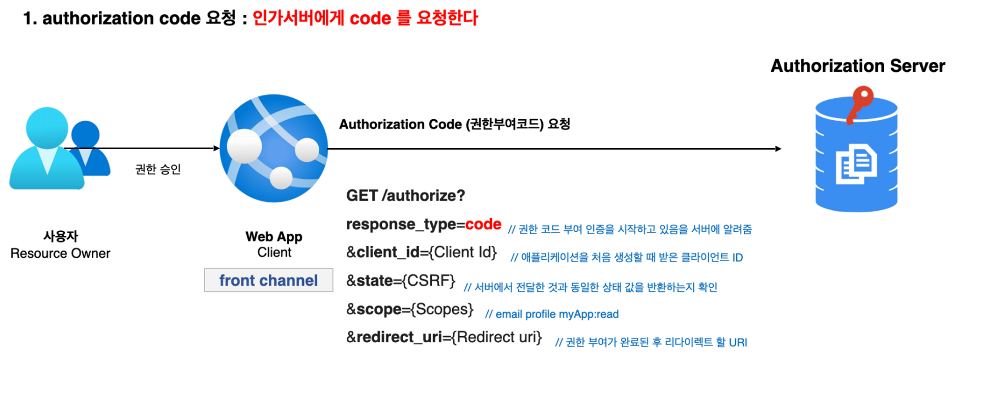

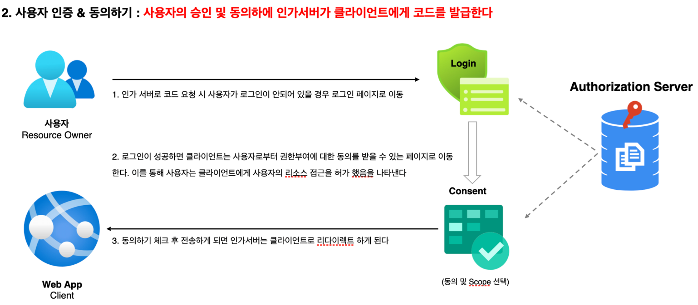

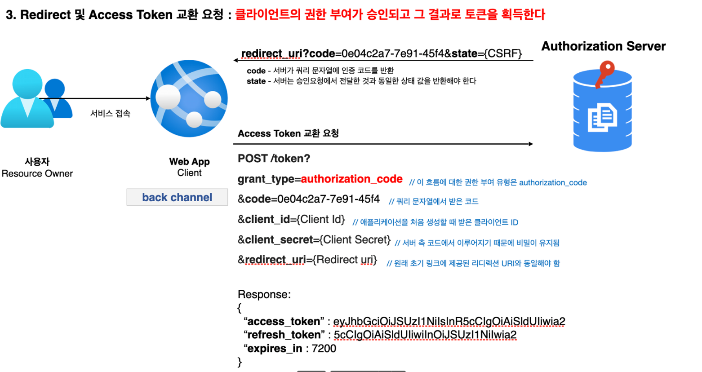

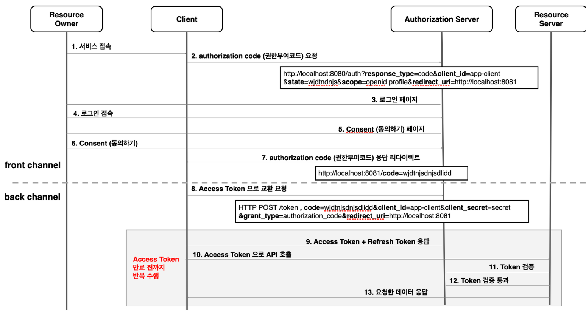

1. 사용자(Resource Owner)가 서비스 접속을 시도한다.
2. Client가 인가서버에게 권한 부여 코드(Authorization code) 요청을 한다.
3. 인가 서버는 요청에 대해 검증을 한다.
4. 검증이 완료되면 사용자의 승인이 필요하기 때문에 로그인페이지로 리다이렉트한다.
5. 로그인 후 제한된 scope에 대해 사용자가 동의하게 한다.
6. 인가 서버는 Client에게 권한부여코드(Authorization code)를 발급하게 한다.
7. `위에 단계까지가 1단계이다. (**front channel**)`
8. 인가 서버로 부터 발급 받은 code로 Access Token으로 교환 요청 ( 필수값들 필수!! )
9. 여러가지 검증이 통과과 되면 `Access Token + Refresh Token` 응답해줌
10. Client는 Access Token을 가지고 Resource Server에다가 데이터를 요청
11. Resource Server에서 Token을 검증하는 단계를 거침 ( 일반적으로 Resource server에서 자체적으로 검증 한다. )
12. Resource Server에서 Token검증이 통과하게 되면 요청한 데이터 응답해줌

## 실습

1. keycloak 인가서버키고 client 등록한다. ( redirect URI 도 설정 )

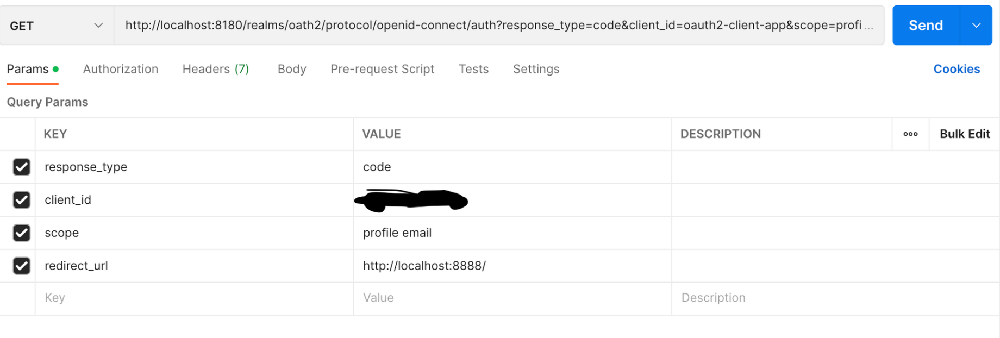

- 이때 code 값을 주는데 이 code는 일회용이다. 한번 발급받아서 access token을 발급받으면 끝

- http://localhost:8888/?session_state=b5ef85c9-6cd2-4317-8394-cef2734df34a&code=634f5403-2268-4bbb-b515-6e85b7051599.b5ef85c9-6cd2-4317-8394-cef2734df34a.999523aa-bb58-49a9-a2dd-e342838a2e8b
2. POST 방식으로 code와 client 정보를 가지고 access 토큰 조회

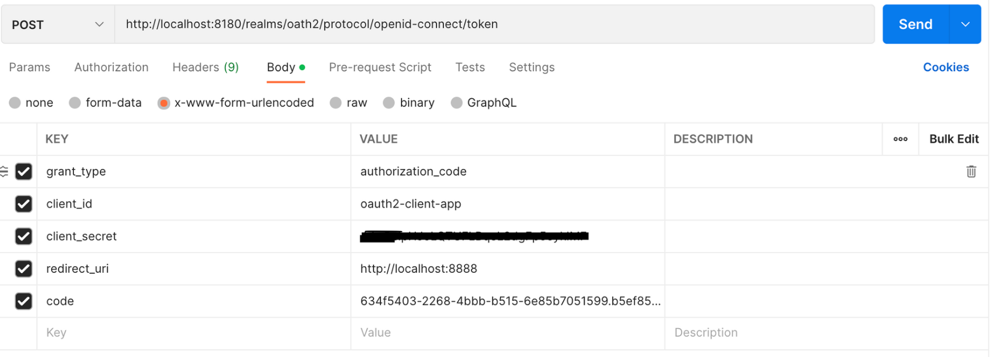

- 밑에 그림처럼 나옴, id token도 준다는데 왜안주지?

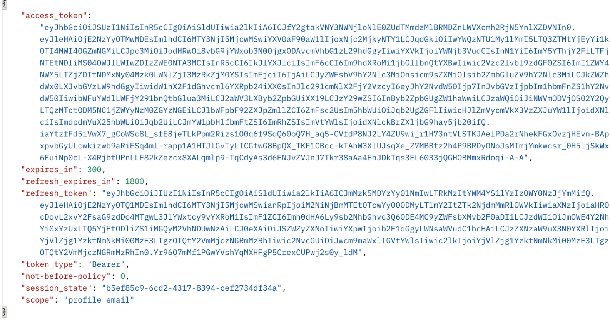

## 결론

- client가 인가서버에게 code 요청을 한다.
- 코드를 발급받고 토큰 요청전에 사용자의 동의가 필요하다.
- 최종적으로 토큰을 발급받으면 권한을 획득하게 되고 리소스 서버로 부터 정보를 요청 받을 수 있다.

# Implicit Grant Type - 암묵적 승인 방식

## 흐름 및 특징

- 클라이언트에서 JavaScript 및 HTML 소스 코드를 다운로드한 후 브라우저는 서비스에 **직접 API 요청**을 한다.
- 코드 교환 단계를 건너뛰고 대신 엑세스 토큰이 쿼리 문자열 조각으로 클라이언트에 즉시 반환된다.
- 이 유형은 back channel이 없으므로 refresh token을 사용하지 못한다.
- 토큰 만료 시 어플리케이션이 새로운 access token을 얻으려면 다시 OAuth 승인 과정을 거쳐야 한다.

## 권한 부여 승인 요청 시 매개변수

- response_type=token(필수), id_token
- client_id (필수)
- redirect_uri (필수)
- scope(선택사항)
- status(선택사항)

## 흐름

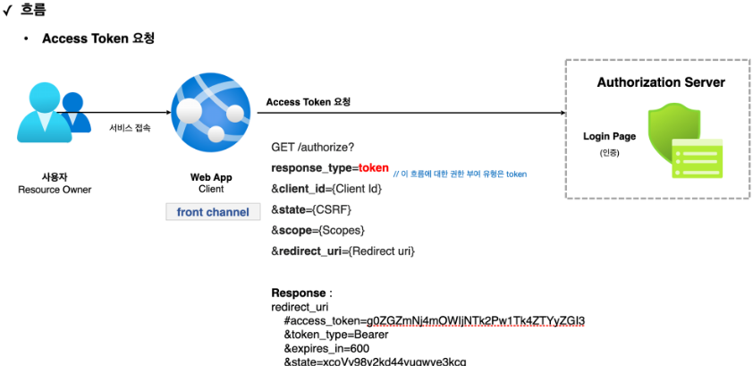

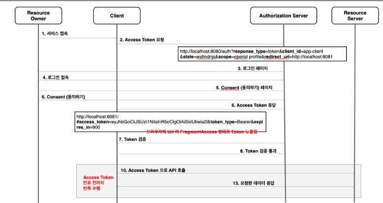

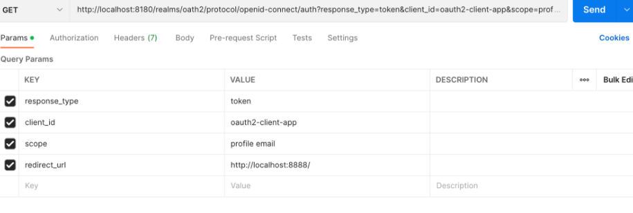

- 위처럼 바로 access token을 준다

# Resource Owner Password Credentials Grant Type - 패스워드 자격증명 승인 방식

## 흐름 및 특징

- 애플리케이션(Client)이 사용자 이름과 암호를 엑세스 토큰으로 교환할 때 사용된다.
  - 클라이언트가 **인가서버에서 저장된** 유저id와 패스워드를 사용자로 부터 받아서 전달한다.
    - 클라이언트가 인가서버에 저장된 id와 pw를 알고 있는다는 거 자체가 위험하다. (어떤 클라이언트인지 모른다)
  - 인가서버에서 유저id와 패스워드가 맞으면 바로 토큰 발급해준다.
- 타사 애플리케이션이 이 권한을 사용하도록 허용해서는 안되고 고도의 신뢰할 자사 애플리케이션에서만 사용해야 한다.

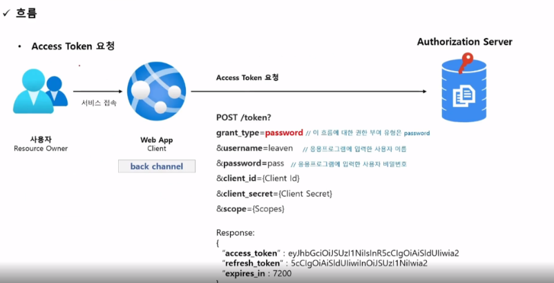

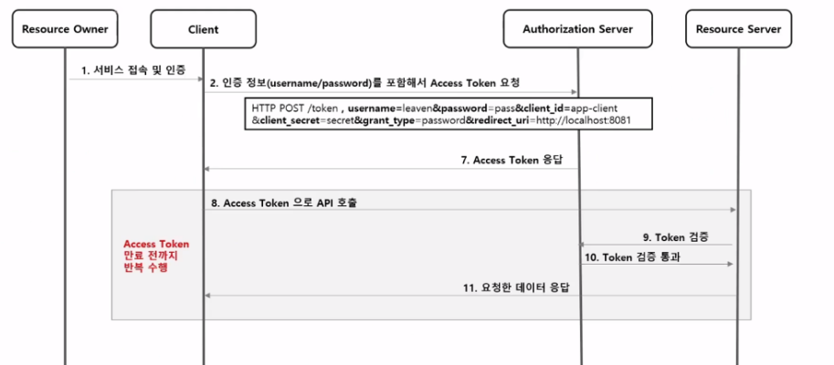

# Client Credentials Grant Type - 클라이언트 자격증명

## 흐름 및 특징

- 애플리케이션이 리소스 소유자인 동시에 클라이언트의 역할을 한다.
- 리소스 소유자에게 권한 위임 받아 리소스에 접근하는 것이 아니라 자기 자신이 애플리케이션을 사용할 목적으로 사용하는 것
- 서버 대 서버간의 통신에서 사용할 수 있으며 IOT 와 같은 장비 어플리케이션과의 통신을 위한 인증으로도 사용할 수 있다.
- Client Id 와 Client Secret을 통해 액세스 토큰을 바로 발급 받을 수 있기 때문에 Refresh Token을 제공하지 않는다.
- Client정보를 기반으로 하기 때문에 사용자 정보를 제공하지 않는다.

### 매개변수

- grant_type = client_credentials (필수)
- client_id (필수)
- client_secret (필수)
- scope (선택사항)

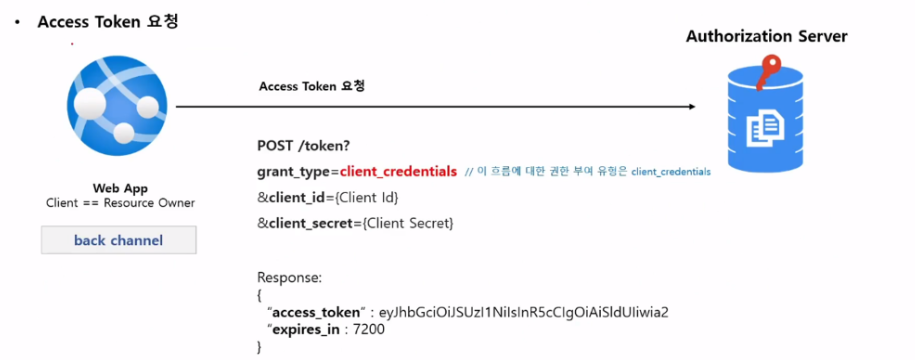

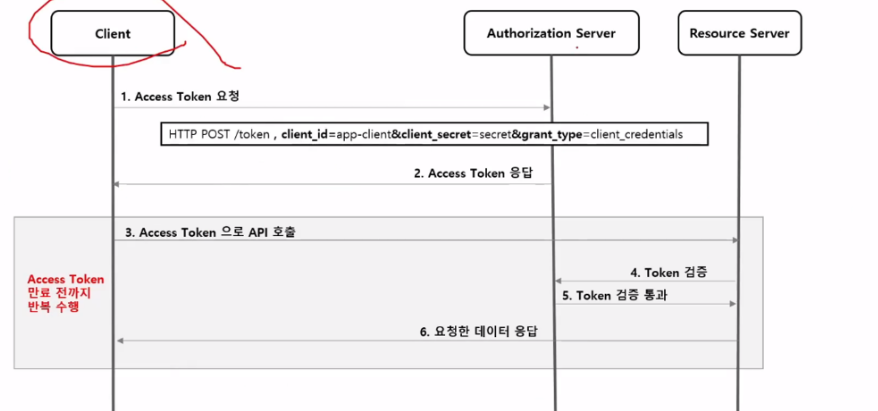
